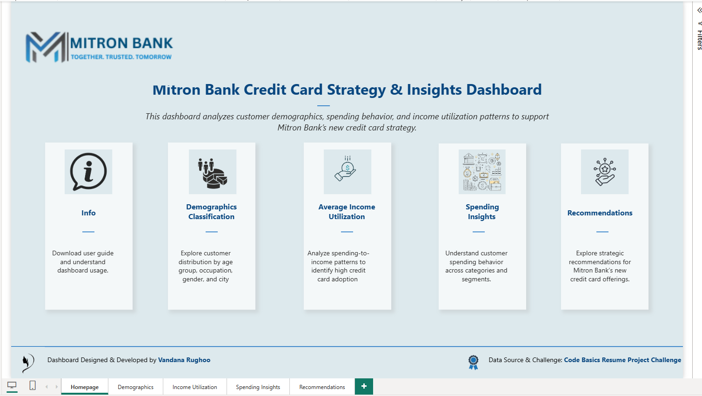
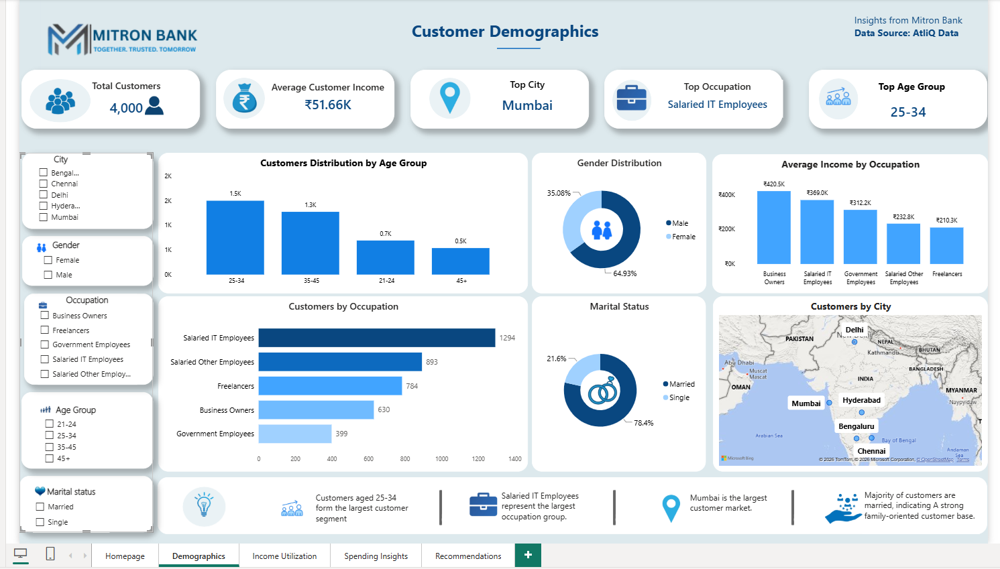
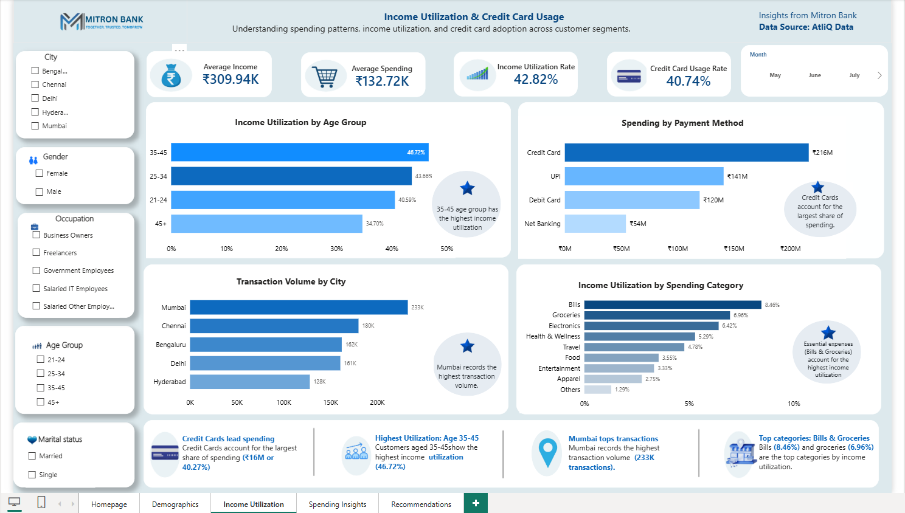
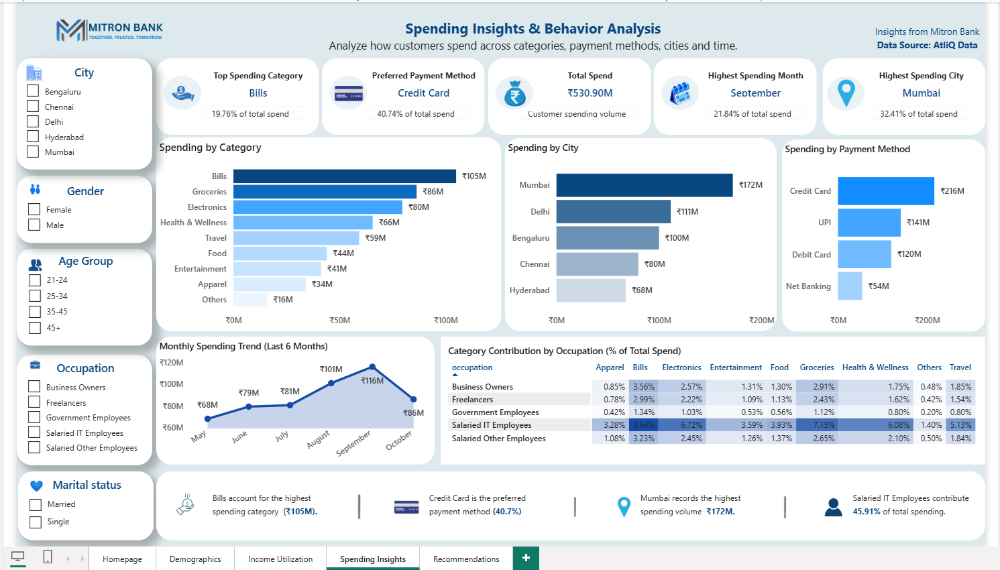
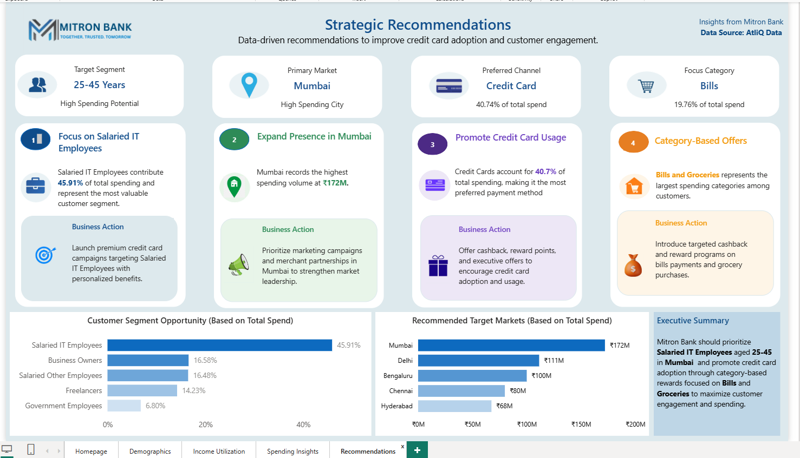

# Mitron Bank Credit Card Analysis

## Project Overview

Mitron Bank, a legacy financial institution headquartered in Hyderabad, plans to launch a new line of credit cards to expand its market presence and product offerings. Before launching the product, the bank requires a deeper understanding of customer demographics, spending behavior, income utilization patterns, and payment preferences.

This project analyzes customer transaction data and transforms it into actionable business insights through an interactive Power BI dashboard. The objective is to support the Product Strategy Team in making data-driven decisions for a successful credit card launch.

---

## Challenge Information

This project was completed as part of the **CodeBasics Resume Project Challenge**:

**"Provide Insights to the Product Strategy Team in the Banking Domain"**

The challenge required participants to analyze customer spending behavior and demographic data for Mitron Bank and provide actionable recommendations to support the launch of a new credit card product.

Special thanks to [CodeBasics](https://codebasics.io/) and AtliQ Data Services for designing the business scenario, dataset, and learning experience that inspired this project.

---

## Business Problem

Mitron Bank intends to introduce a new credit card product but requires insights into customer behavior before proceeding with the launch.

Key business questions addressed include:

* Who are the most valuable customer segments?
* Which cities present the highest market opportunity?
* What are the dominant spending categories?
* Which payment methods are preferred by customers?
* How can Mitron Bank improve credit card adoption and customer engagement?

---

## Project Objectives

* Analyze customer demographics and spending behavior.
* Identify high-value customer segments.
* Understand income utilization patterns.
* Evaluate spending trends across categories and cities.
* Analyze customer payment preferences.
* Provide strategic recommendations to support the credit card launch.

---

## Project Highlights

- Built an interactive 5-page Power BI dashboard.
- Developed KPI cards and DAX measures for customer behavior analysis.
- Performed demographic, income utilization, spending, and market analysis.
- Generated strategic recommendations for Mitron Bank's credit card launch.
- Created executive-level business insights and visual storytelling.

---

## Tools & Technologies

* Power BI
* DAX (Data Analysis Expressions)
* Power Query
* Data Modeling
* Data Visualization
* Dashboard Design
* Business Analysis

---

## Dashboard Structure

### Homepage

Provides project context, navigation, and a high-level overview of the analysis.

### Demographics

Analyzes customer distribution by:

* Age Group
* Gender
* Occupation
* City
* Marital Status

### Income Utilization

Evaluates spending behavior relative to customer income levels and identifies utilization patterns across demographic groups.

### Spending Insights

Provides analysis of:

* Spending by Category
* Spending by City
* Spending by Payment Method
* Monthly Spending Trends
* Occupation-Based Spending Contribution
* Age Group Spending Contribution

### Strategic Recommendations

Converts analytical findings into actionable business recommendations for Mitron Bank's Product Strategy Team.

---

## Key Insights

* Bills account for the highest spending category (₹105M).
* Credit Card is the preferred payment method, contributing 40.7% of total spending.
* Mumbai records the highest spending volume (₹172M).
* Salaried IT Employees contribute 45.91% of total spending, making them the most valuable customer segment.
* September recorded the highest monthly spending volume.

---

## Strategic Recommendations

### 1. Focus on Salaried IT Employees

Launch premium credit card offerings and personalized reward programs targeting Salaried IT Employees, the highest-spending customer segment.

### 2. Expand Presence in Mumbai

Strengthen marketing efforts and merchant partnerships in Mumbai to leverage its high spending potential and customer concentration.

### 3. Promote Credit Card Usage

Introduce cashback programs, loyalty rewards, and exclusive offers to encourage increased credit card adoption and usage.

### 4. Category-Based Offers

Develop targeted reward programs focused on Bills and Groceries, which represent the largest spending categories among customers.

---

## Dashboard Screenshots

### Homepage

### Customer Demographics

### Income Utilization

### Spending Insights

### Strategic Recommendations

---

## Business Impact

This dashboard enables Mitron Bank's Product Strategy Team to:

* Identify high-value customer segments.
* Prioritize high-potential markets.
* Design targeted credit card campaigns.
* Improve customer engagement through category-based rewards.
* Support data-driven decision-making for product launch strategies.

---

## Skills Demonstrated

* Business Intelligence
* Data Storytelling
* Dashboard Design
* KPI Development
* DAX Measures
* Data Modeling
* Data Visualization
* Business Analysis
* Strategic Recommendation Framework

---

## Acknowledgements

* Challenge & Business Scenario: CodeBasics
* Dataset Provider: AtliQ Data Services
* Dashboard Development, Analysis, Insights & Recommendations: Vandana Rughoo

---

## Author

### Vandana Rughoo

Statistical Officer | Data Analyst

Mauritius

GitHub: https://github.com/hnarughoo

LinkedIn: https://www.linkedin.com/in/vandana-rughoo

